# Redline Project

A modern Django web application utilizing Celery and Redis for asynchronous tasks (email delivery) and Docker for seamless service orchestration.

## Table of Contents
1. [Installation & Docker Setup](#1-installation--docker-setup)
2. [Important](#2-important)
3. [Application Features & Demo](#3-application-features--demo)
4. [License](#4-license)

---

## 1. Installation & Docker Setup

The project is fully containerized using **Docker**, meaning no local installation of PostgreSQL or Redis is required.

### Prerequisites
- [Docker Desktop](https://www.docker.com/products/docker-desktop/) installed
- [Git](https://git-scm.com/) installed

### Step-by-Step Setup

1. **Clone the repository:**
   ```bash
   git clone [https://github.com/your-username/redline.git](https://github.com/your-username/redline.git)
   cd redline
2. **Environment Variables:**
   ```bash
   cp .env.example .env
3. **Run migrations:**
   ```bash
   docker exec -it django_app python manage.py migrate
4. **Build and Start with Docker Compose:**
   ```bash
   docker-compose up --build
5. **Access the application:**
   * Web app: `http://127.0.0.1:8000`
   * Admin panel: `http://127.0.0.1:8000/admin`

## 2. Important

> [!IMPORTANT]
> **Celery Worker:** Asynchronous email delivery requires a running Celery worker. In the Docker environment, this process starts automatically. If you are running the project locally on Windows (outside of Docker), you must start the worker manually using the `eventlet` pool:
> `celery -A redline worker -l info -P eventlet`

* **Security & Environment:** The `.env` file contains sensitive data (passwords, secret keys) and is **excluded** from the Git history via `.gitignore`. Set up your own data inside `.env` when first running this project.
* **Database Management:** The project uses **PostgreSQL** within a Docker container named `pgdb`. Database migrations are executed automatically every time you run `docker-compose up`.
* **Email Delivery:** The system uses Gmail's SMTP server. For successful email delivery, a **Google App Password** must be provided in the `.env` file instead of your standard account password.
* **Network Host Configuration:** The database `HOST` is set to `pgdb` for inter-container communication. If you run the Django server natively (local `runserver`) while the database is in Docker, you must change the `HOST` in your `.env` to `127.0.0.1` aswell as `HOST` inside `settings.py` to `127.0.0.1`.
* **Custom Configuration:** To use your own credentials, ensure that you provide valid values in the `.env` file for all keys listed in `.env.example`, particularly the secret key and mail server settings, to ensure the application starts without errors.
* **Bypassing Email Verification:** If you wish to test the application without setting up Celery or SMTP, you can create a superuser via the terminal (`docker exec -it <container_id> python manage.py createsuperuser`) and then manually create your users `profile` in the Django Admin panel to log in directly.

## 3. Application Features & Demo

### 📺 Video Demonstration
[Watch the Project Demo on YouTube](https://youtu.be/7BDbdGJQSzg)

### 📸 Project Walkthrough

#### 1. Authentication & Security
* **Login:** Secure entry point for registered users.
    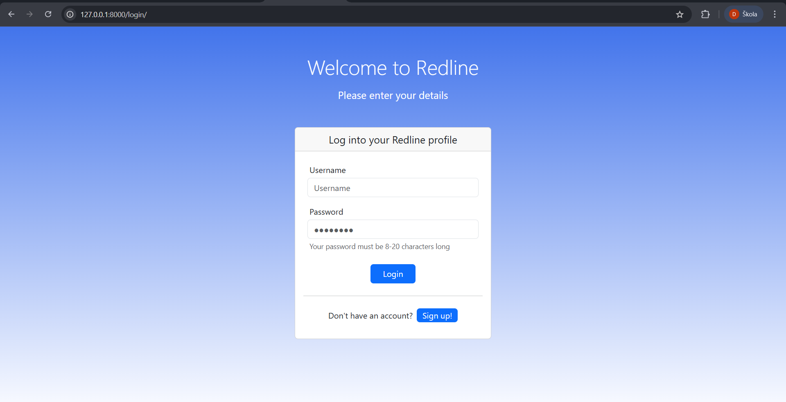
* **Signup:** New user registration with data validation.
    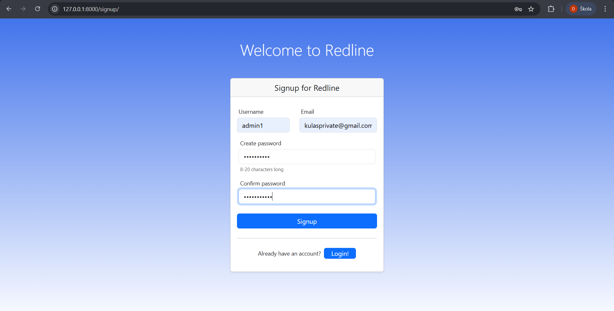
* **Email Verification:** Integration with **Celery & Redis** to handle verification codes.
    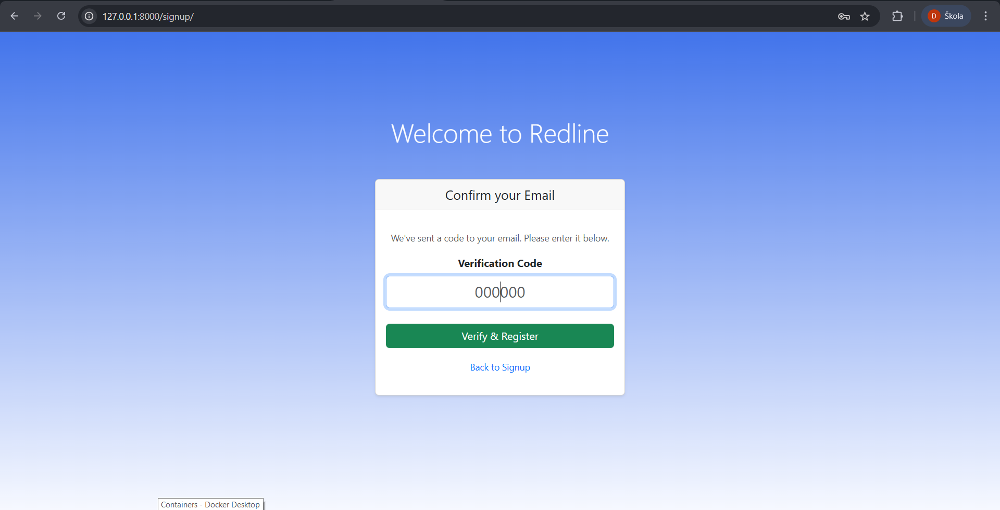
* **Email Confirmation:** Real-time email delivery using SMTP (Gmail).
    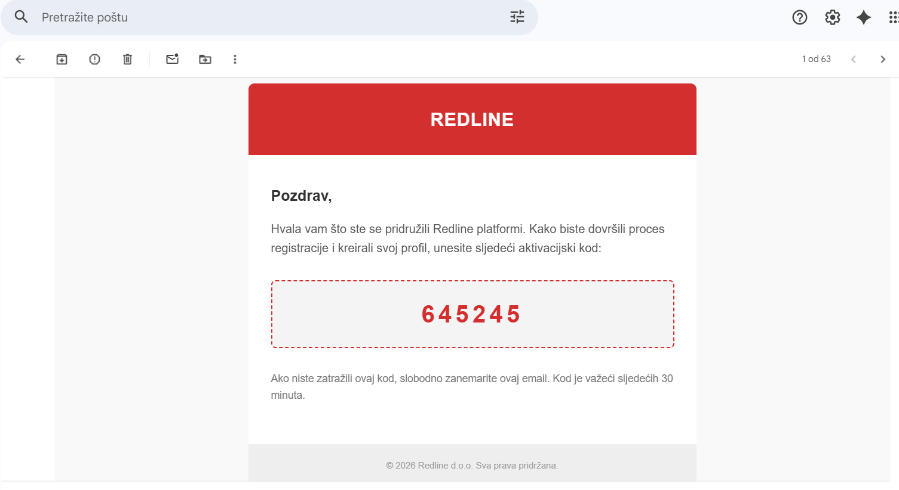

#### 2. The Social Experience
* **User Feeds:** Dynamic display of global content and personalized "Following" feeds.
    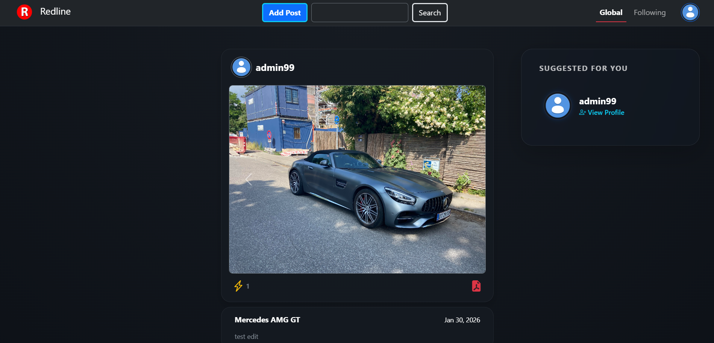
* **Make a Post (Drop a Marker):** Users can drop a marker on an interactive map to mark the exact spot where a photograph was taken, sharing the location along with their post.
    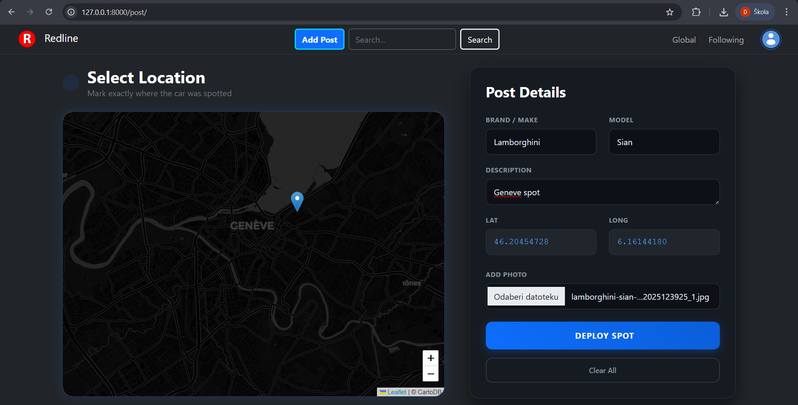

#### 3. User Profiles & Customization
* **My Profile:** Personal activity dashboard.
    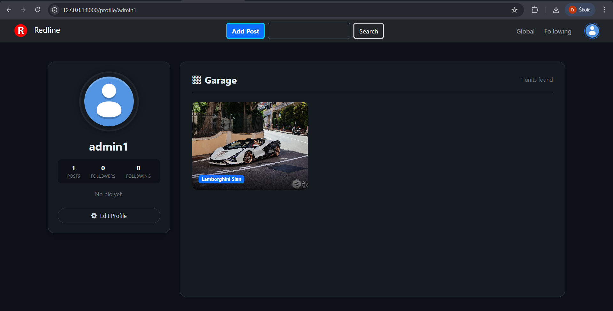
* **Edit Profile:** Fully customizable user settings and profile details.
    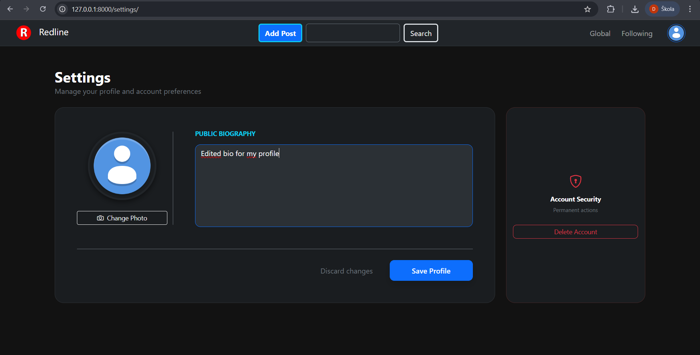
* **Other Users' Profiles:** Interaction hub where you can view others' content and hit **Follow**.
    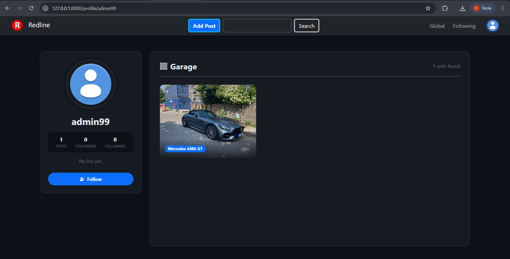

#### 4. Engagement & Interactive Maps
* **Post Interaction:** Like system for engagement and interactive **Leaflet Maps** showing post markers.
    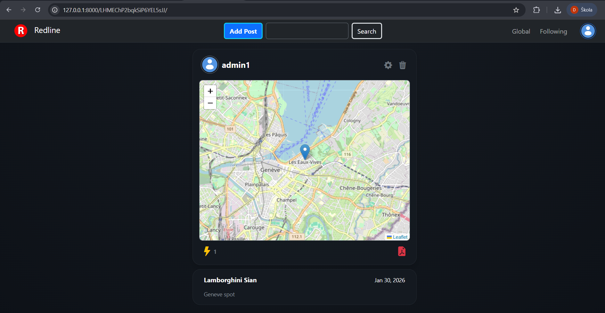
* **Search Functionality:** Powerful search tool to find both users and specific posts.
    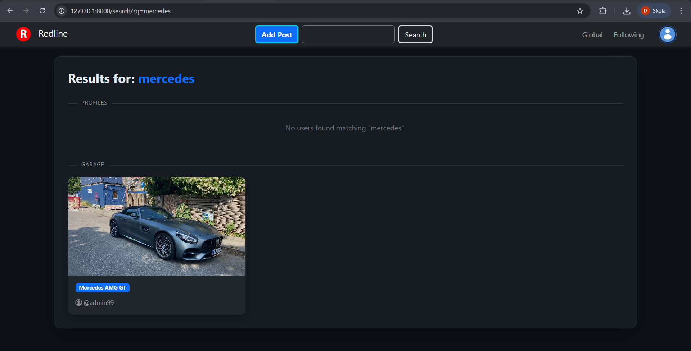


## 4. License

Copyright (c) 2026 Drago Kulaš

This project is licensed under the **MIT License**.
